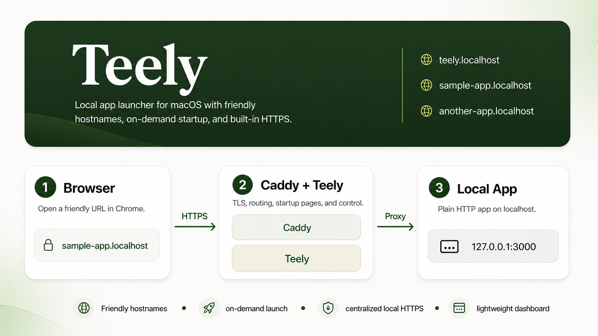
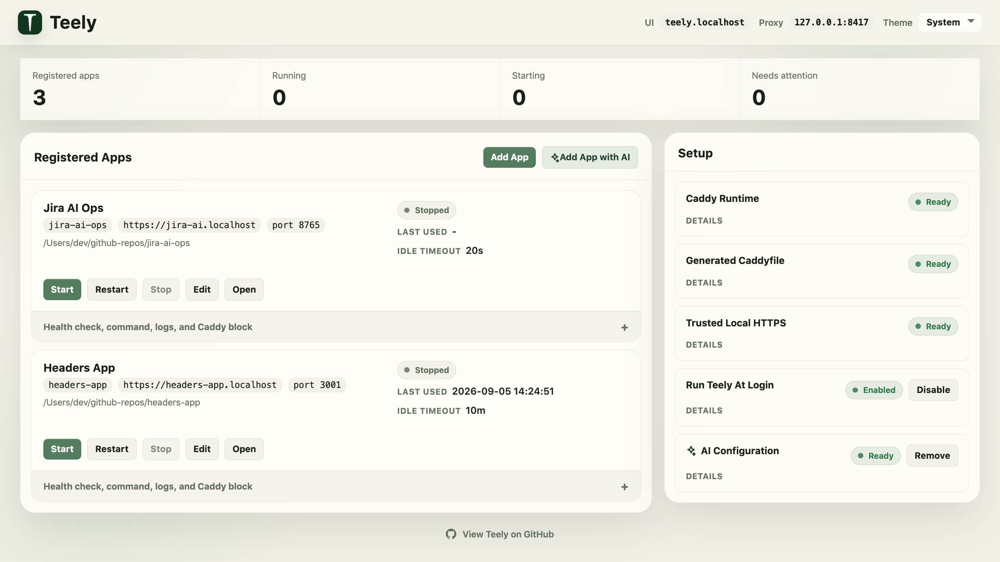

# Teely

[](https://pkg.go.dev/github.com/marksowell/teely)

**Local apps that run only when you use them.**

Teely automatically starts local web applications when they receive an HTTP request, waits for them to become ready, forwards the original request through the cold start, and shuts them down again after they go idle.

It gives your apps friendly `.localhost` URLs and automatic local HTTPS with Caddy, without requiring containers or app-specific launchers. Teely works with arbitrary local commands, so it can replace manually starting and stopping Node.js, Python, Rails, and similar development servers.

Think of it as **local scale-to-zero** or **serverless for localhost**. Teely keeps your local apps teed up and ready to use without keeping all of their dev servers running all the time.

Conceptually:

`request -> Teely starts the app if needed -> waits for readiness -> forwards the request -> shuts the app down after idle`





## Install

```bash
go install github.com/marksowell/teely/cmd/teely@latest
```

## Quick Start

```bash
teely init
teely up
teely trust
```

Then open:

- [https://teely.localhost](https://teely.localhost)

From the dashboard you can:

- add and edit apps
- finish machine setup
- configure AI support for OpenAI, Anthropic, Google
- save AI keys into macOS Keychain

Once AI is configured, **Add App with AI** appears in the dashboard which can draft an app registration from a project folder.

## What Teely Does

- friendly local hostnames like `https://sample-app.localhost`
- starts apps on demand when they receive HTTP traffic
- keeps the original request alive through cold start instead of immediately failing it
- provides a startup page while a browser navigation is waiting for an app to boot
- routes traffic through local HTTPS with Caddy
- stops apps after idle timeout
- works with local app commands directly instead of requiring containers
- gives you a built-in dashboard for setup, status, logs, and controls

## Roadmap

### Targeted for `v0.3`

- add a runtime mode per app:
  - `host-fixed`
  - `host-auto`
  - `isolated`
- add mode-aware validation:
  - `host-fixed`: port must be unique across other `host-fixed` apps
  - `host-auto`: no fixed-port collision check because Teely chooses one at runtime
  - `isolated`: no host-port collision check because the app gets its own network context

## Related Projects

Closest projects in this space include [Coulson](https://github.com/ratazzi/coulson), [Tako](https://tako.sh/docs/development/), and [puma-dev](https://github.com/puma/puma-dev). Teely is aimed at the same wake-on-request local workflow, with a built-in dashboard and plain local app commands.

| Project | Start on request | Stop on idle | HTTPS / hostname | Arbitrary local process | macOS-oriented | UI |
| --- | --- | --- | --- | --- | --- | --- |
| **Teely** | ✅ | ✅ | ✅ Caddy + `.localhost` | ✅ | ✅ | ✅ |
| **[Coulson](https://github.com/ratazzi/coulson)** | ✅ | ✅ | ✅ local domains | Partial | Somewhat | ✅ |
| **[Tako](https://tako.sh/docs/development/)** | ✅ | ✅ | ✅ trusted HTTPS + `.test` | Partial | Somewhat | CLI |
| **[puma-dev](https://github.com/puma/puma-dev)** | ✅ | ✅ | ✅ HTTPS + local domains | Partial | ✅ | ❌ |

## Common Commands

```bash
teely up
teely status
teely restart
teely down
```

## Troubleshooting

Check status first:

```bash
teely status
```

If routing or HTTPS is acting up, restart both processes:

```bash
teely restart
```

Teely keeps logs under your configured `runtime_dir`.

Default install location:

- `~/Library/Application Support/Teely/.teely/logs/teely.log`
- `~/Library/Application Support/Teely/.teely/logs/caddy.log`

If you run Teely from a repo-local config instead, those logs live under that config's local `.teely/logs/` directory.

To temporarily enable Caddy debug logging, add `debug` to the top-level block in your generated Caddyfile, then restart Teely:

```caddy
{
	debug
	local_certs
	skip_install_trust
}
```

Remove `debug` again after you finish troubleshooting.

## License

Apache-2.0. See [LICENSE](LICENSE).
